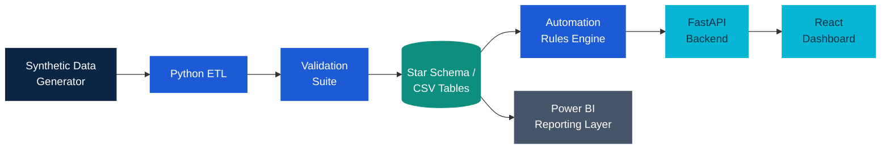
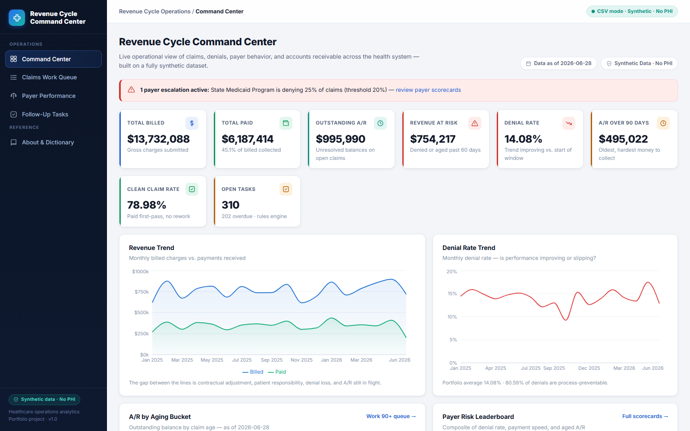
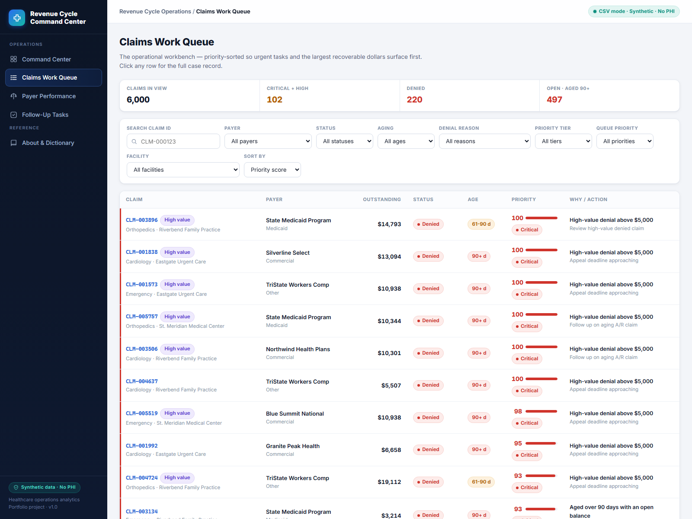
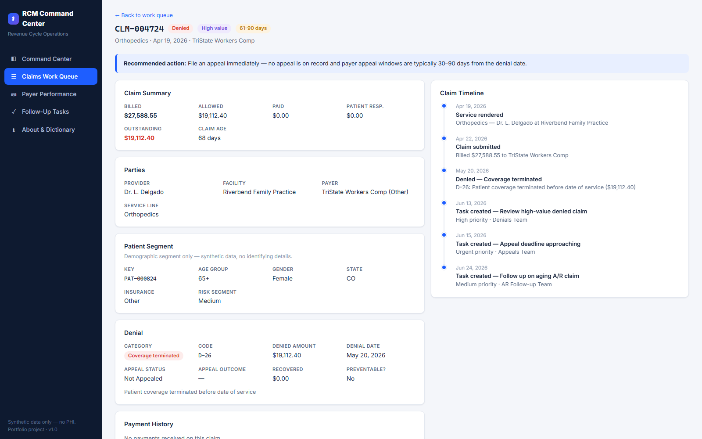
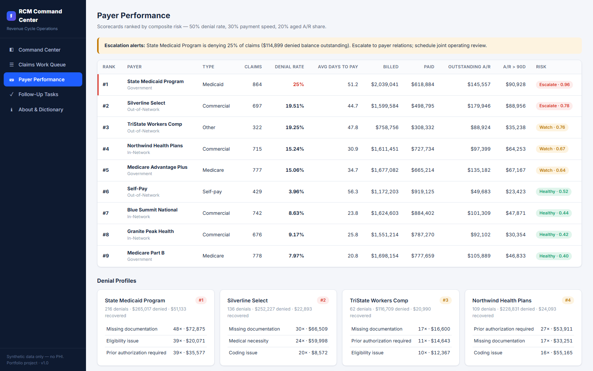

<div align="center">

# Healthcare Revenue Cycle Command Center

**An end-to-end healthcare analytics and decision-support platform for claims, denials, payer performance, A/R aging, revenue risk, and follow-up work.**

<br/>


<br/>

[](#dashboard-preview)
[](#architecture)
[](docs/project_case_study.md)
[](#how-to-run)
[](database/data_dictionary.md)

<br/>

[](https://healthcare-rcm-command-center.onrender.com)
[](https://healthcare-rcm-api.onrender.com/docs)
[](https://github.com/Darshita-dp/Healthcare-Revenue-Cycle-Command-Center)
[](docs/deployment.md)

</div>

> **Synthetic data only — no PHI.** Every patient, provider, facility, and payer record is programmatically generated. All organization names are fictional and all NPIs are fake. This is a portfolio project, **not** a real healthcare deployment.

---

## At a Glance

| | |
|---|---|
| **Project type** | Healthcare analytics + workflow automation |
| **Business problem** | Denied, delayed, and aging claims create revenue leakage |
| **Core users** | Revenue cycle leaders, billing analysts, denial-management teams |
| **Main outcome** | Prioritized claims work queue + recovery-impact estimate |
| **Data** | Synthetic healthcare revenue cycle data only (fixed seed, reproducible) |
| **Stack** | Python · SQL · FastAPI · React · Power BI documentation |

**Tech stack by layer**

| Layer | Technology |
|---|---|
| Data generation & ETL | Python 3.11+ (pandas, numpy), deterministic seeded generator |
| Warehouse | PostgreSQL 16 star schema (Docker Compose) — CSV mode by default |
| Analytics | SQL (window functions, CTEs), documented KPI logic |
| Automation | Python rules engine → follow-up tasks & payer alerts |
| API | FastAPI + Uvicorn |
| Frontend | React 18, TypeScript, Vite, custom design system |
| BI | Power BI (documented pages + DAX measures + export queries) |

---

## Business Problem

Healthcare organizations lose revenue when claims are **denied, delayed, unpaid, or not followed up in time**. The money doesn't disappear in one dramatic moment — it leaks $4,000 at a time: a denial nobody works, an appeal window that quietly expires, a payer whose denial rate drifts up for months before anyone notices.

This system helps teams **find where money is stuck, understand why, and decide which claims to work first.** It answers the questions a revenue cycle team asks every day:

- Which claims were denied, and **why**?
- Which payers deny the most, and which need escalation?
- How much revenue is **at risk right now**?
- Which claims are aging past **30 / 60 / 90 days**?
- Which claims should the team follow up on **first**?
- Are denial rates trending **better or worse**?
- How much was **recovered** after appeals and follow-up?

---

## What This System Does

- **Tracks** claims, denials, payments, payer performance, and A/R aging in one governed model
- **Calculates** executive and operational KPIs (denial rate, revenue at risk, A/R over 90, appeal recovery)
- **Automates** follow-up tasks and payer alerts from transparent business rules
- **Scores** every claim 0–100 with an explainable, rule-based priority model
- **Estimates** potential recovery from working the top-priority claims first
- **Presents** insights through a FastAPI backend, a React dashboard, and a documented Power BI reporting layer

**Synthetic dataset (seed 42 — every run reproduces the same data):**

| Patients | Providers | Facilities | Payers | Claims | Denials | Payments |
|:--:|:--:|:--:|:--:|:--:|:--:|:--:|
| 1,200 | 110 | 8 | 9 | 6,000 | ~850 | ~5,200 |

Plus month-end A/R snapshots per open claim and rule-based follow-up tasks. Produced by the deterministic generator at [etl/generate_synthetic_data.py](etl/generate_synthetic_data.py).

---

## Architecture



**Flow:** Synthetic Data → Python ETL → Validation → Star Schema / CSV Tables → Automation Rules → FastAPI → React Dashboard → Power BI Layer.

CSV-first is deliberate: the whole system runs with `pip install` + `npm install` — no database required. The identical schema also exists as PostgreSQL DDL with keys, checks, and indexes. Full details: [docs/architecture_diagram.md](docs/architecture_diagram.md) · [docs/data_model_diagram.md](docs/data_model_diagram.md) · [docs/process_flow.md](docs/process_flow.md).

---

## Key Features

| Feature | Why it matters |
|---|---|
| **Synthetic healthcare dataset** | Realistic denial rates, payment lags, and appeal outcomes with zero PHI and no external downloads |
| **Python ETL pipeline** | Deterministic, modular, logged — reproducible byte-for-byte on every run |
| **SQL star schema** | 7 dimensions + 5 facts; conformed dimensions make every KPI a short, comparable join |
| **Validation suite** | 46 checks gate the data: integrity, financial reconciliation, aging math |
| **Automation rules engine** | Turns analytics into prioritized, SLA-dated work routed to the right team |
| **Explainable Claim Priority Score** | A 0–100 score that shows *exactly why* each claim is urgent — no black box |
| **Revenue Recovery Simulator** | Estimates recoverable revenue from working the top-priority queue first |
| **FastAPI backend** | 12 documented endpoints, runs in CSV mode with zero infrastructure |
| **React operational dashboard** | Six executive and operational views on a custom design system |
| **Power BI reporting layer** | 5 documented pages + production-ready DAX measures |

---

## Decision Support

Two features push this past a reporting dashboard into decision support. Both are **rule-based and fully transparent — not a black-box ML model** — which matters when staff must justify why a claim was worked.

### Explainable Claim Priority Score

**In plain terms:** the system gives each claim a **0–100 score** and shows *exactly why* the claim is urgent.

Each claim also gets a tier — **Critical / High / Medium / Low / Monitor** — plus an ordered list of the business reasons behind the number. Points accrue from high-value denials, A/R aging, payer denial risk, appeal-deadline urgency, denial category, and open financial exposure. The full point schedule lives in one reusable module: [automation/priority_scoring.py](automation/priority_scoring.py).

```text
Priority Score: 100 / 100        Tier: Critical
─────────────────────────────────────────────────
  High-value denial above $5,000 ............ +30
  Appeal window at risk (denied 20+ days) ... +20
  Aged 61–90 days with an open balance ...... +18
  Payer denial rate above 20% ............... +15
  Open exposure above $10,000 ............... +15
  Missing-documentation denial .............. +8
─────────────────────────────────────────────────
  Raw total 106  →  capped at 100
```

### Revenue Recovery Simulator

**In plain terms:** the system estimates how much revenue could be recovered if the team works the **top 25, 50, or 100** priority claims.

Pick a claim count and a recovery-rate assumption (**30% / 40% / 50%**); it ranks open claims by priority score, sums a de-duplicated at-risk base (denied + outstanding, without double-counting), and returns the estimated recoverable revenue, the tier workload, and the top recovery drivers. The recovery rate is an explicit **planning assumption** applied to at-risk balances — a decision aid, not a guaranteed collection.

---

## Dashboard Preview

<table>
  <tr>
    <td width="50%" valign="top"><b>Command Center</b><br/></td>
    <td width="50%" valign="top"><b>Claims Work Queue</b><br/></td>
  </tr>
  <tr>
    <td width="50%" valign="top"><b>Claim Detail</b><br/></td>
    <td width="50%" valign="top"><b>Payer Performance</b><br/></td>
  </tr>
</table>

*All screenshots are captured from the running React app against the live API — none are mockups.* More views (follow-up tasks, data dictionary) in [powerbi/screenshots/](powerbi/screenshots/).

---

## Functional Modules

| Module | Description |
|---|---|
| **Data Generator** | Creates deterministic synthetic healthcare revenue cycle data |
| **ETL Pipeline** | Transforms claims, denials, payments, and A/R snapshots |
| **Validation** | Checks data quality and relationship integrity (46 checks) |
| **Analytics SQL** | Defines KPI and reporting logic ([analytics/kpi_queries.sql](analytics/kpi_queries.sql)) |
| **Automation** | Creates tasks and alerts from business rules |
| **API** | Serves KPIs, claims, payer metrics, tasks, priority insights, recovery simulator |
| **Frontend** | React dashboard for operational and executive views |
| **Power BI** | Documented executive reporting layer with DAX measures |

**Automation rules** (full spec: [automation/alert_rules.md](automation/alert_rules.md)):

| Rule | Condition | Action |
|---|---|---|
| High-value denial | Denied amount > $5,000 | High-priority task → Denials Team |
| A/R aging risk | Outstanding > $1,000 and age > 60 days | Follow-up task |
| Missing documentation | Denial category = Missing documentation | Task → Documentation Team |
| Payer escalation | Payer denial rate > 20% | Payer alert |
| Appeal deadline | Denial > 20 days old, not appealed | Urgent task |

**Data model** — star schema with conformed dimensions. Dimensions: `dim_patient`, `dim_provider`, `dim_facility`, `dim_payer`, `dim_denial_reason`, `dim_service_line`, `dim_date`. Facts: `fact_claims`, `fact_denials`, `fact_payments`, `fact_ar_snapshot`, `fact_followup_tasks`. Full column reference: [database/data_dictionary.md](database/data_dictionary.md).

---

## KPIs

| KPI | Definition |
|---|---|
| **Denial Rate** | Denied claims ÷ total claims |
| **Clean Claim Rate** | Claims paid without denial or rework ÷ total claims |
| **Revenue at Risk** | Outstanding on denied + aging (> 60-day) open claims |
| **Outstanding A/R** | Billed − paid − patient responsibility on open claims |
| **A/R > 90 Days** | Outstanding amount in the 90+ aging bucket |
| **Avg Days to Payment** | Mean of (payment date − submission date) on paid claims |
| **Preventable Denial Rate** | Denials flagged preventable ÷ total denials |
| **Appeal Success Rate** | Appeals overturned ÷ appeals resolved |

Full list with SQL: [analytics/kpi_queries.sql](analytics/kpi_queries.sql). Every KPI is defined once and mirrored across SQL, the API, and DAX.

---

## How to Run

**Prerequisites:** Python 3.11+, Node 18+. PostgreSQL/Docker optional — everything runs in CSV mode.

**1 · Backend / data setup**

```bash
python -m pip install -r requirements.txt
python etl/run_pipeline.py                    # generate synthetic dataset
python etl/validate_data.py                   # 46 data-quality checks
python automation/generate_followup_tasks.py  # follow-up tasks + alerts
```

**2 · API** — http://localhost:8000 (Swagger UI at `/docs`)

```bash
python -m pip install -r api/requirements.txt
uvicorn api.main:app --reload
```

**3 · Frontend** — http://localhost:5173

```bash
cd frontend
npm install
npm run dev
```

**4 · Optional PostgreSQL**

```bash
docker compose up -d          # PostgreSQL 16 on localhost:5432
python etl/load_to_postgres.py
```

Shortcuts via Makefile: `make pipeline`, `make validate`, `make api`, `make frontend`.

---

## Deployment

The application is **live on [Render](https://render.com)**, deployed from the committed Blueprint at [`render.yaml`](render.yaml) as two services:

| Service | What it is |
|---|---|
| `healthcare-rcm-api` | FastAPI backend (Python), CSV-mode synthetic data layer, dataset built during deploy |
| `healthcare-rcm-command-center` | React + Vite static site, published from `frontend/dist` |

**Live URLs**

| Resource | Live URL |
|---|---|
| React Application | <https://healthcare-rcm-command-center.onrender.com> |
| FastAPI Backend | <https://healthcare-rcm-api.onrender.com> |
| Swagger API Docs | <https://healthcare-rcm-api.onrender.com/docs> |
| Health Check | <https://healthcare-rcm-api.onrender.com/health> |

**PostgreSQL is optional and is not required** for the portfolio deployment — the API runs in CSV mode.

**Hosted request flow**

```
Browser  →  Render Static Site  →  FastAPI Web Service  →  In-memory synthetic CSV dataset
             (VITE_API_URL              (CSV mode default,       (built by etl/run_pipeline.py
              baked at build)            CORS from FRONTEND_URL)   during the backend deploy)
```

**Environment variables — enter once in the Render dashboard on first Blueprint sync**

| Service | Variable | Value |
|---|---|---|
| Backend | `FRONTEND_URL` | Full frontend origin, e.g. `https://healthcare-rcm-command-center.onrender.com` (scheme required, no trailing slash, no path) |
| Frontend | `VITE_API_URL` | Full backend origin, e.g. `https://healthcare-rcm-api.onrender.com` (embedded at build time; changing it requires a frontend redeploy) |

Render **may append a hostname suffix** if a service name is already claimed. In the current deployment both services took the predicted names above; if you fork and redeploy, update both variables to whatever Render actually assigns.

**Free-tier note:** the backend Web Service may spin down when idle. The first request after inactivity is slower while the service wakes up; subsequent requests are fast. The frontend already shows a public-friendly *"temporarily unavailable — please try again in a moment"* message during that window — this does not indicate a broken deployment.

Full procedure, environment-variable reference, and troubleshooting (CORS errors, missing CSVs, cold starts, direct-route 404s): **[docs/deployment.md](docs/deployment.md)**.

---

## Result

A complete, runnable revenue cycle analytics system:

- **Working synthetic dataset** — 6,000 claims across 9 payers with full denial/appeal lifecycles
- **Validated data pipeline** — 46-check suite gating referential integrity and financial reconciliation
- **12 API endpoints** — KPIs, claims, payers, tasks, priority insights, recovery simulator
- **React dashboard** — six operational and executive views
- **Automation** — rule-generated, SLA-dated follow-up tasks and payer alerts
- **Explainable priority scoring** — transparent 0–100 score with per-claim drivers
- **Revenue recovery simulator** — recovery estimates from the top-priority queue
- **Power BI documentation** — 5 documented pages and production-ready DAX measures

---

## Business Impact

In a real deployment, a system like this would let a revenue cycle team:

- **Stop high-value leakage** — catch large denials the day they post instead of weeks later
- **Never miss an appeal window** — deadline alerts convert silent write-offs into dated work
- **Focus scarce staff** — a priority-ranked queue replaces spreadsheet triage
- **Hold payers accountable** — denial-rate and payment-speed scorecards back the escalation conversation
- **Plan recovery targets** — size the payoff of a focused work sprint before committing staff

---

## Future Improvements

- Predictive denial-risk scoring on claim attributes before submission
- Write-back workflow (assign, note, close tasks from the UI)
- dbt transformation layer with tests and lineage
- 835/837 EDI ingestion for realistic sourcing
- Role-based access, audit logging, and facility-level row security

---

## Documentation

[Case Study](docs/project_case_study.md) · [Architecture](docs/architecture_diagram.md) · [Data Model](docs/data_model_diagram.md) · [Process Flow](docs/process_flow.md) · [Demo Script](docs/demo_script.md) · [Deployment Guide](docs/deployment.md) · [Data Dictionary](database/data_dictionary.md)

---

## Disclaimer

This project uses **synthetic / public-style healthcare data only** and does not contain real patient information. All patient, provider, facility, and payer records are programmatically generated, all organization names are fictional, and all NPI numbers are fake. It is a **portfolio and educational project — not a real healthcare deployment** and not medical, billing, or financial advice.
