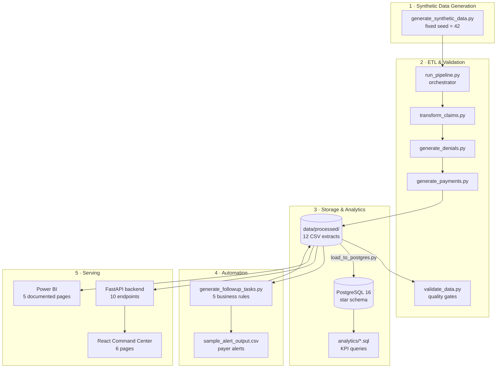

# Architecture — Healthcare Revenue Cycle Command Center

## System Overview

The system is organized in five layers: **data generation**, **ETL & validation**, **storage & analytics**, **automation**, and **serving (API + UI + BI)**.

## Layer Responsibilities

### 1. Synthetic Data Generation
`etl/generate_synthetic_data.py` builds all dimensions and base claims with a fixed random seed (42), so the dataset is fully reproducible and requires no external downloads. Payer behavior is parameterized: each payer has its own denial propensity, payment-lag distribution, and allowed-amount ratio, which makes downstream payer analytics meaningful rather than uniform noise.

### 2. ETL & Validation
`run_pipeline.py` orchestrates generation → claim transformation (status, aging, financial fields) → denial generation (reason, appeal lifecycle, recovery) → payment generation (lag, method) → A/R snapshots. `validate_data.py` is a separate quality gate: row counts, null keys, negative amounts, referential integrity, and business-rule consistency (e.g., denial records only exist for denied/appealed claims).

### 3. Storage & Analytics
CSVs in `data/processed/` are the canonical output and power the API, automation, and Power BI without any infrastructure. The identical schema exists as a PostgreSQL star schema (`database/schema.sql`) with FKs and indexes; `etl/load_to_postgres.py` loads the CSVs when a database is available (Docker Compose provided). All KPI logic lives in `analytics/*.sql`.

### 4. Automation
The rules engine reads claims, denials, and payer statistics, then emits prioritized follow-up tasks (`fact_followup_tasks.csv`) and payer escalation alerts. Rules are idempotent — re-running does not duplicate tasks (dedup key: claim + task type).

### 5. Serving
- **FastAPI** serves KPIs, claims (with 7 filter parameters), payers, denials, tasks, aging, and alerts. It defaults to CSV mode (zero infra) and can point at PostgreSQL via `DATABASE_URL`.
- **React + TypeScript + Vite** frontend is the operational UI for revenue cycle staff.
- **Power BI** is the executive reporting layer; the processed CSVs load directly, and all measures are documented in `powerbi/measures.md`.

## Key Design Decisions

| Decision | Rationale |
|---|---|
| CSV-first, PostgreSQL-optional | The whole project runs with `pip install` + `npm install`; no Docker required for reviewers |
| Fixed seed (42) | Reproducible dataset; screenshots, tests, and docs stay consistent |
| Star schema | Standard Kimball pattern for BI; identical structure in CSV and PostgreSQL |
| Rules engine separate from ETL | Automation logic evolves independently of the data model |
| No PHI by construction | Patients are synthetic keys + demographic segments; no names or real identifiers anywhere |
