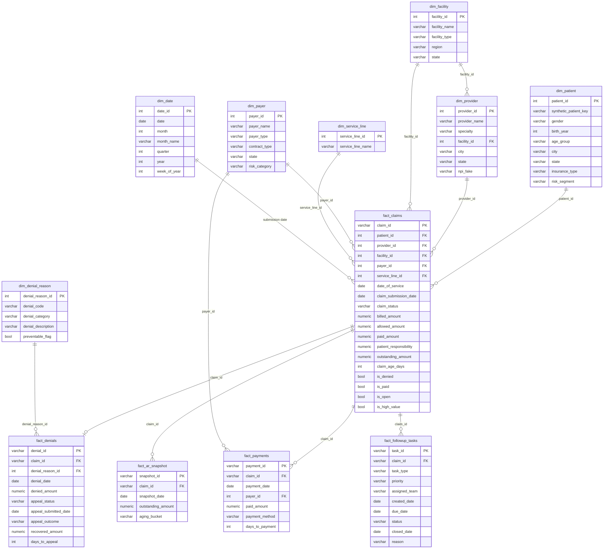

# Data Model — Star Schema

Kimball star schema: `fact_claims` is the hub; four child facts carry `claim_id` and inherit dimensional context through it. Full column definitions in [database/data_dictionary.md](../database/data_dictionary.md).

## Grain Statements

| Table | Grain |
|---|---|
| fact_claims | One row per claim |
| fact_denials | One row per denial event (0..1 per claim in this model) |
| fact_payments | One row per remittance transaction |
| fact_ar_snapshot | One row per open claim per month-end |
| fact_followup_tasks | One row per claim per automation rule |

## Design Notes

- **Surrogate integer keys** on all dimensions; business-style string keys (`CLM-`, `DEN-`, `PMT-`) on facts for readability in worklists.
- **Conformed dimensions:** `dim_payer` and `dim_date` are shared by multiple facts, making denial, payment, and A/R analyses directly comparable.
- **`dim_provider` → `dim_facility`** is a snowflake edge, kept because facility is both a claim attribute and a provider attribute (provider home facility).
- **Flags over joins:** `is_denied`, `is_open`, `is_high_value` are precomputed on `fact_claims` so BI tools and the API filter without subqueries.
- **No PHI by construction:** patients carry only demographic segments and generated keys; provider NPIs are `FAKE`-prefixed.
