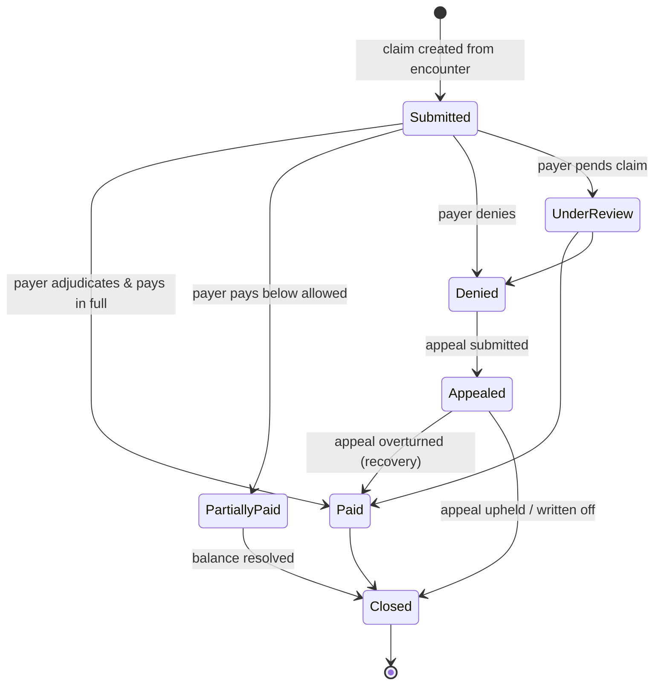
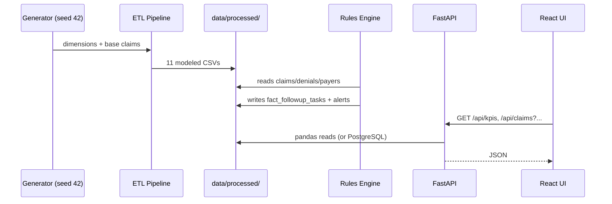

# Revenue Cycle Process Flow

How a claim moves through the system, and where analytics and automation intervene.

## Claim Lifecycle

## Operational Flow (who does what)

1. **Claim submission** — provider bills payer; `fact_claims` records billed / allowed / expected amounts and submission date.
2. **Adjudication** — payer pays (`fact_payments`), denies (`fact_denials`), partially pays, or pends the claim.
3. **Nightly analytics refresh** — ETL pipeline recomputes claim age, outstanding amounts, and A/R aging buckets (`fact_ar_snapshot`).
4. **Automation pass** — the rules engine scans the fresh data:
   - High-value denials → **Denials Team**, priority High
   - Aging A/R (> 60 days, > $1,000) → follow-up queue
   - Missing-documentation denials → **Documentation Team**
   - Payer denial rate > 20% → escalation alert to payer relations
   - Unappealed denials nearing appeal deadline → **urgent** task
5. **Worklist execution** — staff open the React Command Center, work the priority-sorted queue, and drill into claim detail (timeline, payments, denial reason, recommended action).
6. **Recovery tracking** — appeal outcomes and recovered amounts flow back into `fact_denials`; leadership sees recovery and trend KPIs in Power BI.

## Data Flow Sequence

## Where the Money Leaks (and where this system catches it)

| Leakage point | Catch mechanism |
|---|---|
| Denial never worked | High-value denial rule + work queue priority |
| Appeal window missed | Appeal-deadline rule (20-day trigger, urgent) |
| Claim ages silently past 90 days | A/R aging rule + aging dashboards |
| Payer behavior degrades | Payer denial-rate alert + scorecard trend |
| Preventable denials repeat | Preventable-denial KPI by category and facility |
